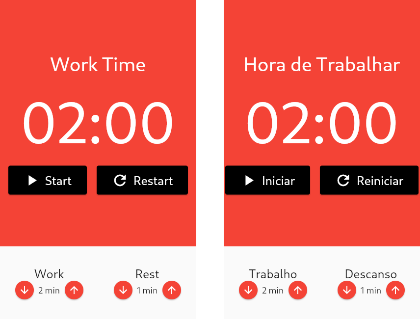

Monitore o tempo de trabalho e de descanso.

Este aplicativo foi criado para pôr em prática os conhecimentos adquiridos sobre a linguagem dart e o framework flutter.

A documentação estará disponível em breve no link [documentação](https://andremeireles.github.io/pomodoro/doc/api/index.html). Lá você encontrará maiores informações sobre o código.

---

### Preview

  

<a href="https://github.com/andremeireles/pomodoro/releases/latest/">Baixe a sua versão</a>

### 💬 Desenvolvimento

- [x] PomodoroPage
- [ ] SettingsPage
- [ ] `shared_preferences` para persistência de dados

### 🔭 Aprendizado

- Clean Code
- Dart null-safety
- Componentização de widgets
- Gerência de estado com `mobx`
- Reatividade com `provider`
- Internacionalização (`de, en, pt_br`)
- Suporte a desktop (botões de minimizar, fechar)

### 🌱 Próximos passos

- Animações
- Tema claro e escuro
- Suporte a mais idiomas
- Aumentar e diminuir os minutos, se o botão for mantido pressionado
